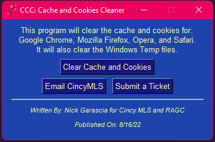

# CCC - A Cache and Cookie Cleaner

>Once launched, the application will automatically remove:

>1. Google Chrome - Cache and Cookies 
    >a. **Keeps bookmarks. You have to re-enable them after launching Chrome**
>2. Mozilla Firefox - Cache and Cookies
>3. Opera - Cache and Cookies
>4. Apple Safari - Cache and Cookies
>5. Windows Temporary Files
>6. Microsoft Edge - Cache and Cookies 
    >a. ***Coming soon***

>Additionally, the app allows you to email the Cincy MLS by launching your default mail application as well as submit a HelpSpot ticket by launching your default web browser.
   
***

*** 

### Written By: *Nick Garascia*
### Written On: *8/16/22*

